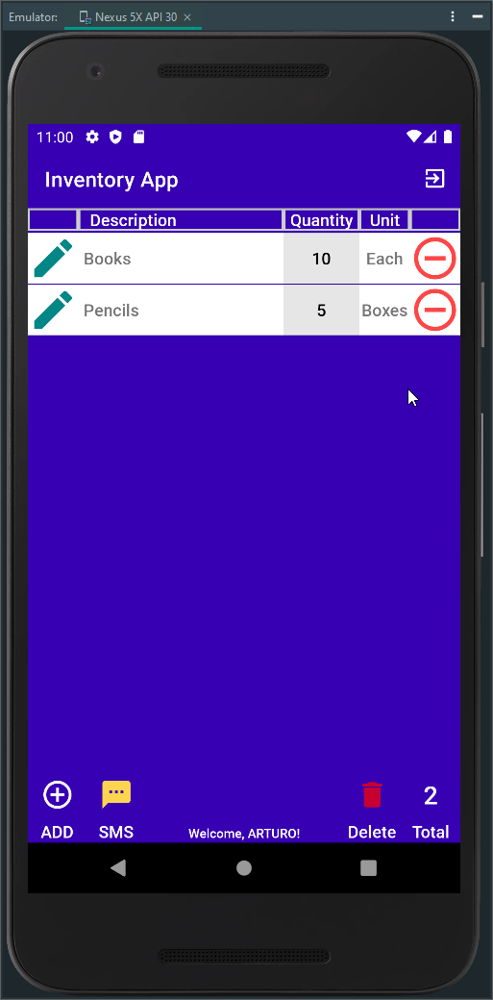
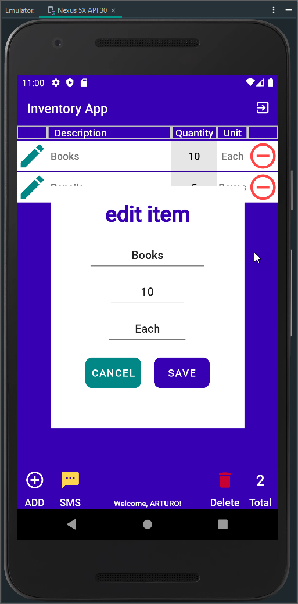
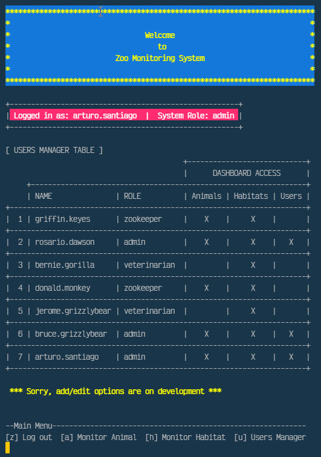

I enrolled in the Computer Science program at SNHU in March 2021 with the initial goal of securing advancement opportunities in the Army. While I initially chose this program due to the job prospects it offered, I was pleasantly surprised by the depth of software development courses it included. As I delved into programming fundamentals, I found myself thoroughly enjoying the classes and discovering the myriad of skills that were directly applicable to my role as a Radio Technician.

Throughout the program, I've honed my attention to detail, logical thinking, troubleshooting, and computer literacy skills. Moreover, I've developed the ability to create comprehensive project plans and effectively interpret customer requirements. The coursework has equipped me with proficiency in programming languages such as Java, JavaScript, Python, and C++, empowering me to tackle various challenges in my professional domain.

In my role as a Radio Technician, the knowledge gained from the program has proven invaluable. Understanding the fundamentals of digital communication systems has enhanced my ability to comprehend how systems encode, decode, and implement encryption algorithms. Additionally, my grasp of software-defined radio architecture has positioned me ahead of my peers, enabling me to interpret and optimize system performance effectively. 

One of the most significant takeaways from the program has been the skill to sift through vast amounts of data generated by LMR systems and distill it into actionable insights. This capability has enabled me to generate useful reports that enhance overall system performance and contribute to mission success.

Looking ahead, I am eager to continue leveraging the skills and knowledge acquired from the program to further advance in my career. Whether it's pursuing advanced certifications or exploring leadership opportunities, I am confident that the foundation laid by the Computer Science program will continue to propel me towards achieving my goals.

  
| **Hard Skills**     | **Soft Skills**     |
|:-------------------:|:-------------------:|
| Programming         | Communication       |
| Data Analysis       | Attention to Detail |
| Data Visualization  | Critical Thinking   |
| Data Structures     | Problem Solving     |
| Operating Systems   | Time Management     |
| Algorithms          | Adaptability        |
| Technical Writing   | JAVA                |
| Machine Learning    | Python              |
| Mobile Development  | C++                 |

### _Artifact Overview_

The artifact I have chosen to enchance for Software Design and Engineering, Algorithms and Data Structure, and Database categories is the Final project for the CS 360: Mobile Architecture and Programming. The Software Design and Engineering category plan was to improve the user interface, improve the readability of the code base, incorporating a logging mechanism, and proper encryption algotithms to the databases. The Algorithm and Data Structure enhancement plan was to create a scalable data structure that is tailored to the indivdual user. The Database enhancement plan was to incorporate process to import and export csv file to allow users to import thier current information and export the application database to transfer between systems. The enhancement plan also included the addtion of a filter to sort information. 

    <a href="#">
        <button style="font-size: 10px; font-weight: 500; background: #4169e1; color: #ffffff; border-radius: 50px; border-style: solid; border-color: #4169e1; padding: 5px 5px;">Back to Top &#8593;</button>
    </a>

 

### _Code Review_

As a software engineer, I know that code reviews are critical aspects of software development. Code reviews ensure quality assurance for our project's code and often identify critical bugs early on in its life cycle. However, the typical code review can be tedious with too many meetings and meetings that waste time. We can think that code reviews add an unnecessary bureaucracy to our development life cycle or believe we are too small to warrant the effort. In both instances, we are mistaken.

Code review is a systematic examination of the computer source code, sometimes known as peer review. I intend to find and fix mistakes overlooked in the initial development phase, improving the overall quality of the software and my developers' skills. In the professional world of programming, code reviews are a staple of quality assurance. A code review can be accomplished in various ways and with any requirements, but it is a straightforward concept stripped down to its bare essence. It is necessary for anyone interested in software engineering best practices.

    
    
<em>Figure 3 - Zoo Monitoring System Program Java Code Screenshot</em>

Code reviews catch errors when they’re cheap to fix, strengthen the team’s abilities, and add a certain amount of fault tolerance to the organization or individuals to better recover from disruptive changes. It results in better code, which is more easily maintained. Exercising a code review of the selected artifacts for software design and engineering, algorithms and data structure, and databases helped me to capacitate and employ strategies that help in the building of collaborative environments that enable diverse audiences to support organizational decision making in the field of computer science based on the critical elements of existing functionality code analysis, and enhancements.

### _Code Review Videos Link_

	

    <a href="#">
        <button style="font-size: 10px; font-weight: 500; background: #4169e1; color: #ffffff; border-radius: 50px; border-style: solid; border-color: #4169e1; padding: 5px 5px;">Back to Top &#8593;</button>
    </a>

 

As showcased in the [artifact code review](CodeReview "Refinement Plan and Code Review"), the artifact selected for the software design and engineering category is the **mobile application Inventory App**. The app's goal is to track an inventory of items using android mobile devices. The software was planned, designed, and develop as part of the CS360 Mobile Architecture and Programming computer science course. The application is developed in JAVA programming language with integration to the relational database SQLite. The development and programming tool used is Android Studio IDE. The testing and running of the app are through a Nexus device emulator inside Android Studio.

This artifact involved an entire software design and engineering process. It consists of design considerations of user experience and user interaction with different screens and actions that the application includes. Ensure an intuitive use of the application and its features through industry-standard icons and symbols. The engineering of practices of validate input data, architect and design for security mindset, and default deny. Evolve design and engineering considerations of relationship and functionality in their algorithms and data structure between the different classes and methods, and database in their layouts and source code. Evolve using a relational database to store the data created, read, updated, and deleted by users through the operation and use of the application.

    &nbsp;&nbsp;&nbsp;
    
    
<em>Figure 4 - Items Activity and Edit Alert Dialog Screenshot</em>

I designed and evaluated computing solutions that solve a given problem using algorithmic principles, computer science practices, and standards appropriate to our solution while managing the trade-offs involved in design choices through the implemented enhancements. The enhancements made the application fully functional by introducing a complete user CRUD functionality in the item's activity and improving the functionality, structure, and efficiency of the SQLHelper class function and methods.

I follow mobile development principles and best practices using user-centered design principles and industry standards through application development with this enhancement. The application of user-centered design principles demonstrates my ability to use well-founded and innovative techniques, skills, and tools in computing to implement computer solutions that deliver value and accomplish industry-specific goals. I implemented and practiced quality assurance techniques effective in identifying and eliminating vulnerabilities.

### _Artifact Software Design and Engineering_

	

    <a href="#">
        <button style="font-size: 10px; font-weight: 500; background: #4169e1; color: #ffffff; border-radius: 50px; border-style: solid; border-color: #4169e1; padding: 5px 5px;">Back to Top &#8593;</button>
    </a>

 

As presented in the [artifact code review](CodeReview "Refinement Plan and Code Review"), the artifact selected for the algorithms and data structure category is the **Zoo Monitoring System Program**. The program aims to develop an authentication system that manages authentication and authorization for zookeeper users and administrators. The program was planned, designed, and developed as part of the IT145 Foundation in Application Development computer science course. The program is produced in the JAVA programming language as a standalone application running in the computer terminal. The initial development and programming tool used was Apache NetBeans IDE; however,  I worked on the enhancements using a text editor. The testing and running of the app are through the computer terminal.

I selected this artifact because it involved understanding a program algorithm composed of two central systems, an authentication/authorization system, with the enhancement of modules for a monitoring system. Once the users enter the program, they only should see data related to their role. The artifact consists of design considerations to authenticate and authorize a user into the monitor system based on user credentials and the accountability of the user interaction with different modules screen and actions according to their role in the monitor system.

    
    
<em>Figure 5 - Zoo Monitoring System User Management Dashboard Screenshot</em>

I designed software that considers and interprets user needs and implement them into a program with a relation of activities in an organized structure. The enhancements allow the user to list animal/habitat options by reading from external animal files or habitats files, know the animals' activities in their care, and monitor their living habitats. Understanding the algorithms required by the program scenario gives the ability to translate it to pseudocode as one program code.

I developed an organized structure of a block of codes that can be separated into a primary class and four classes (modules). One of the four classes is a menu (Display Class) repetitive in the three key system modules, RoleModule, MonitorModule, and User Module. I introduce GUI actions into the program base to clear the shell screen, display a header and banner, and use two third-party classes, one for ANSI colors and the other for wrap lines. These actions align with user-centered design principles to demonstrate our ability to use well-founded and innovative techniques, skills, and tools in computing to implement maintainable computer solutions that deliver value and accomplish industry-specific goals.

### _Artifact Algorithms and Data Structures_

	

    <a href="#">
        <button style="font-size: 10px; font-weight: 500; background: #4169e1; color: #ffffff; border-radius: 50px; border-style: solid; border-color: #4169e1; padding: 5px 5px;">Back to Top &#8593;</button>
    </a>

 

As described in the [artifact code review](CodeReview "Refinement Plan and Code Review"), the artifact selected for the databases category is the **Salvare Search for Rescue Web App**. The web application aims to develop a web interface that works with an existing database from animal shelters to identify and categorize available dogs to train for different rescues. The web app was planned, designed, and developed for the CS340 Client/Server Development computer science course. The application is developed in Python with the Dash framework and the non-relational database MongoDB. The integration of Python and MongoDB is through the python driver PyMongo. The application can run in Jupyter Notebook as a test tool and the computer terminal with an internet browser. The application's functionality involves a CSV data file of existing dogs in shelters to import into MongoDB, the import of dependencies such as Python PyMongo driver, Python libraries, Dash framework, and a Python source code and CRUD module to manipulate the data imported into MongoDB.

This artifact involved a multi-tier application with a Model View Controller (MVC) and RESTful protocol design to extend the HTTP protocol to provide an application programming interface (API). The most attractive concept of the MVC pattern is a separation of concerns. The model's job is to manage the data, MongoDB, and Python data structures. The view's job is to decide what the user sees and how on their screen, Dash framework. The controller's responsibility is to pull, modify, and provide data to the user, the PyMongo driver. Each record in the MongoDB database is a document described in BSON, a binary representation of the data retrieved by the web app in a JSON format. When the main app file is executed in the computer terminal, the user opens an internet browser new tab pointing to the corresponding app address. The browser starts loading and generates the client-facing web application dashboard like the following screen:

    
    
<em>Figure 6 - Salvare Search Web App Client/Database Dashboard Screenshot</em>

The artifact enhancements focused on recreating the web application in a Windows environment after developing the source code in the Apporto Virtual Lab, a university remote desktop Linux platform. In recreating the web application, I designed software that considers and interprets user needs and implements them in an organized structure. Guided by the produced initial documentation, I recreated the web application environment, updating and revising the documentation according to the actions executed to replicate and run the web application in a Windows terminal.

The process of setup and running the web application was challenging. However, I demonstrated my abilities to use well-founded and innovative techniques, skills, and tools in computing practices through the operation of the setup of Python and MongoDB before starting to follow the guidance in the web application documentation. Going through Python and MongoDB's setup procedures and updating the web app source code functionality because of changes in the PyMongo driver version and an upgraded MongoDB platform showcase my implementation of computer solutions that deliver value and accomplish industry-specific goals.  

### _Artifact Databases_

	

    <a href="#">
        <button style="font-size: 10px; font-weight: 500; background: #4169e1; color: #ffffff; border-radius: 50px; border-style: solid; border-color: #4169e1; padding: 5px 5px;">Back to Top &#8593;</button>
    </a>

## Reviews

<blockquote id="reviews" class="review-container" cite="https://learn.snhu.edu/d2l/lms/grades/my_grades/main.d2l?ou=1014915">
	
	
Brooke Goggin, M.S., M.S., M.S., Ed.D(ABD) SNHU Computer Science Adjunct Faculty

	<em>"Being able to present your work in a cohesive manner is a skill that you will continue to refine in your career. The Zoo Monitoring with security and efficiency enhancements and interface as well as your extensive narratives is great work. This is a sound demonstration of making code  more concise and therefore with this change a bit faster. Wonderful explanation of what you did with the application to integrate Python with the Dash framework. Code is clean and well commented! You made it. Congratulations and you should be proud. The hard skills and soft skills table is great. Very well done portfolio with clear content of your depth of understanding!"</em>
</blockquote>

    <a href="#">
        <button style="font-size: 10px; font-weight: 500; background: #4169e1; color: #ffffff; border-radius: 50px; border-style: solid; border-color: #4169e1; padding: 5px 5px;">Back to Top &#8593;</button>
    </a>

