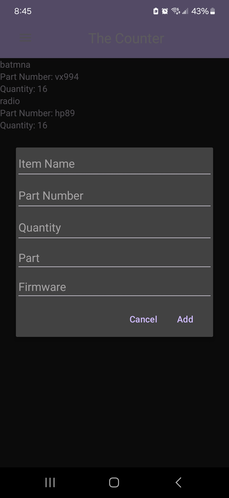

# _Professional Self Assessment_

I enrolled in the Computer Science program at SNHU in March 2021 with the initial goal of securing advancement opportunities in the Army. While I initially chose this program due to the job prospects it offered, I was pleasantly surprised by the depth of software development courses it included. As I delved into programming fundamentals, I found myself thoroughly enjoying the classes and discovering the myriad of skills that were directly applicable to my role as a Radio Technician.

Throughout the program, I've honed my attention to detail, logical thinking, troubleshooting, and computer literacy skills. Moreover, I've developed the ability to create comprehensive project plans and effectively interpret customer requirements. The coursework has equipped me with proficiency in programming languages such as Java, JavaScript, Python, and C++, empowering me to tackle various challenges in my professional domain.

In my role as a Radio Technician, the knowledge gained from the program has proven invaluable. Understanding the fundamentals of digital communication systems has enhanced my ability to comprehend how systems encode, decode, and implement encryption algorithms. Additionally, my grasp of software-defined radio architecture has positioned me ahead of my peers, enabling me to interpret and optimize system performance effectively. 

One of the most significant takeaways from the program has been the skill to sift through vast amounts of data generated by LMR systems and distill it into actionable insights. This capability has enabled me to generate useful reports that enhance overall system performance and contribute to mission success.

Looking ahead, I am eager to continue leveraging the skills and knowledge acquired from the program to further advance in my career. Whether it's pursuing advanced certifications or exploring leadership opportunities, I am confident that the foundation laid by the Computer Science program will continue to propel me towards achieving my goals.

  <table>
    <tr>
      <th style="font-weight: bold;">Hard Skills</th>
      <th style="font-weight: bold;">Soft Skills</th>
    </tr>
    <tr>
      <td>Programming</td>
      <td>Communication</td>
    </tr>
    <tr>
      <td>Data Analysis</td>
      <td>Attention to Detail</td>
    </tr>
    <tr>
      <td>Data Visualization</td>
      <td>Critical Thinking</td>
    </tr>
    <tr>
      <td>Data Structures</td>
      <td>Problem Solving</td>
    </tr>
    <tr>
      <td>Operating Systems</td>
      <td>Time Management</td>
    </tr>
    <tr>
      <td>Algorithms</td>
      <td>Adaptability</td>
    </tr>
    <tr>
      <td>Technical Writing</td>
      <td>JAVA</td>
    </tr>
    <tr>
      <td>Machine Learning</td>
      <td>Python</td>
    </tr>
    <tr>
      <td>Mobile Development</td>
      <td>C++</td>
    </tr>
  </table>

# _Artifact Overview_

The artifact I have chosen to enchance for Software Design and Engineering, Algorithms and Data Structure, and Database categories is the Final project for the CS 360: Mobile Architecture and Programming. The Software Design and Engineering category plan was to improve the user interface, improve the readability of the code base, adhering to proper security and industry standards, incorporating a logging mechanism, and proper encryption algotithms to the databases. The Algorithm and Data Structure enhancement plan was to create a scalable data structure that is tailored to the indivdual user. The Database enhancement plan was to incorporate process to import and export csv file to allow users to import thier current information and export the application database to transfer between systems. The enhancement plan also included the addtion of a filter to sort information. 

    <a href="#">
        <button style="font-size: 10px; font-weight: 500; background: #4169e1; color: #ffffff; border-radius: 50px; border-style: solid; border-color: #4169e1; padding: 5px 5px;">Back to Top &#8593;</button>
    </a>

 

# _Code Review_

Below you can find the link to the informal code review where I talk about the intital code base and the improvement that are going to be made. 

<iframe src="https://youtu.be/HLgYiAfuDyM" width="640" height="480"></iframe>

    <a href="#">
        <button style="font-size: 10px; font-weight: 500; background: #4169e1; color: #ffffff; border-radius: 50px; border-style: solid; border-color: #4169e1; padding: 5px 5px;">Back to Top &#8593;</button>
    </a>

 

# _Software Design and Engineering_

The CS 360: Mobile Architecture and Programming final project was a excellent project to perform an enhancement of the software design and engineering category. The enhancement plan was to improve the user interface, improve the readability of the code base, incorporating a logging mechanism, adhering to proper security and industry standards, and proper encryption algotithms to the databases. The inital project met the basics of what the original customer required. The code base was clustered together and not propely broken into the seperate classes. The enhancement plan that was developed ensured the longevity of the application to fufill a larger customer base instead of being focused on a single individual. 

I have developed a secuity mindset that anticipates adversarial exploits in software architecture and diesigns to expose potential vulnerabilities, mitigate design flaws and ensure privacy and enhanced security of data and resources by completing the implementation of the addition of the encryption algorithms to the databases by adding a hashing method to encrypt the user's login information. Also by adhering to security standards by using anti-SQL injection techniques to prevent unwanted database manipulation. 

I have also demonstrated the ability to use well-founded and innovative techniques, skills, and tools in computing practices for the purpose of implementing computer solutions that deliver value and accomplish industry-specfic goals by implementing the reworking the code base and properly sperating the classes into their own individual files, implementing a logging mechnism and adhering to proper industry standards. Reworking the code base to seperate the files enhances the readability of code. It also allows for detailed comments that describe the class in depth and allows for other developers the abiltiy to understand the class and adapt the code base to other projects. The logging mechnism allows for a developer to conduct a performance envaulation of how the application works and troubleshoot errors that occur during development and release. 

While I was performing the enhancements this category I learned the importance of the use of modular code, seperation of classes,  and the importance of logging mechnisms in a mobile application. The use of modular code allows for the code base to be lot cleaner and more readable. The seperation of classes also was a key factor to enhance the readability of the code base. With the seperation of classes the code is more organized and allow for a header comment at the beginning of each file that descirbes the class and methods inside each class. 

    <a href="#">
        <button style="font-size: 10px; font-weight: 500; background: #4169e1; color: #ffffff; border-radius: 50px; border-style: solid; border-color: #4169e1; padding: 5px 5px;">Back to Top &#8593;</button>
    </a>

# _Algorithms and Data Structures_

The CS 360: Mobile Architecture and Programming final project was a excellent project to perform an enhancement of the Algorithm and Data Structure category. The enhancement plan was to create a scalable data structure that is tailored to the indivdual user. Since the original data structure only consisted of the 3 fields that were required by the original customer it was a speacialized software tailored to an individual. With the introduction of the enhancement the application can be tailored to any user. The enhanced application still has the 3 original fields, but now has the ability to add new columns that can be customized by the user. This flexible dynamic data structure is perfect to fit into any companies inventory needs.

I have demonstrated the ability to use well-founded and innovative techniques, skills, and tools in computing practices for the purpose of implementing computer solutions that deliver value and accomplish industry-specific goals by implementing the addtion of the flexible data structure. The flexible data structure components consist of a new inserting method and an updated review method that returns the new columns with its corresponding information related to the column. 

While enhancing the data structure, I gained firsthand insight into the cascading effects that occur when introducing a new concept to an application. Every facet, from the user interface to log statements, is impacted and requires updates. The most challenging aspect was adapting the user interface to accommodate the new columns, which demanded significant effort to resolve. This involved introducing new classes capable of dynamically updating the database returns. Additionally, I had to refine the insertion function to ensure the user interface dynamically reflects all active columns. Moreover, adjustments were made to log statements to accurately capture the system's response to the user's input of new information. This experience underscored the intricate interplay between different components of the application and highlighted the importance of thorough testing and iteration in software development.  

    <a href="#">
        <button style="font-size: 10px; font-weight: 500; background: #4169e1; color: #ffffff; border-radius: 50px; border-style: solid; border-color: #4169e1; padding: 5px 5px;">Back to Top &#8593;</button>
    </a>

# _Databases_

The CS 360: Mobile Architecture and Programming final project was a excellent project to perform an enhancement of the Database category. The enhancement plan was to add a filter function and the ability to import and export csv files to the application. The original application only had an insertion function. The enhanced application consist of the original insertion function, import csv function, export csv function and a filter function. The introduction of the import csv function allows for users of the application to intergrate the application into the user's work flow more easily and removes the need for the user to input information line by line. The export csv function allows the user to extract information from the application and create a workplace of interoperable systems that seemlessly intergrate information using csv files. The filter function is a great enhancement that allows a user to query only pertinent information. 

I have demonstrated the ability to use well-founded and innovative techniques, skills, and tools in computing practices for the purpose of implementing computer solutions that deliver value and accomplish industry-specific goals by implementing the impot and export of csv functions and the filter function. With the enhanced application having these functions, it increases the useability and interoperability of the application. 

While enhancing the database I learned the importance of researching the needs of the customer. While the original application met the basic requirements of the customer the need of a interoperable system in a warehouse is a huge benefit. The addtion of importing and exporting csv files create this interoperability that is required. While performing the addion of these enhancements I learned the skills of file handling in a mobile architecture which is an invaluable skill when dealing with interoperability.

    <a href="#">
        <button style="font-size: 10px; font-weight: 500; background: #4169e1; color: #ffffff; border-radius: 50px; border-style: solid; border-color: #4169e1; padding: 5px 5px;">Back to Top &#8593;</button>
    </a>

# _Original_

    

        
        
<em>Figure 1 Original Login Screen</em>

    

    

        
        
<em>Figure 1 Original Main Screen</em>

    

    

        
        
<em>Figure 1 Original Add Item Dialog</em>

    

# _Enhanced_

    

        
        
<em>Figure 1 Enhanced Login Screen</em>

    

    

        
        
<em>Figure 1 Enhanced Menu Screen</em>

    

    

        
        
<em>Figure 1 Enhanced Add Item Dialog</em>

    

